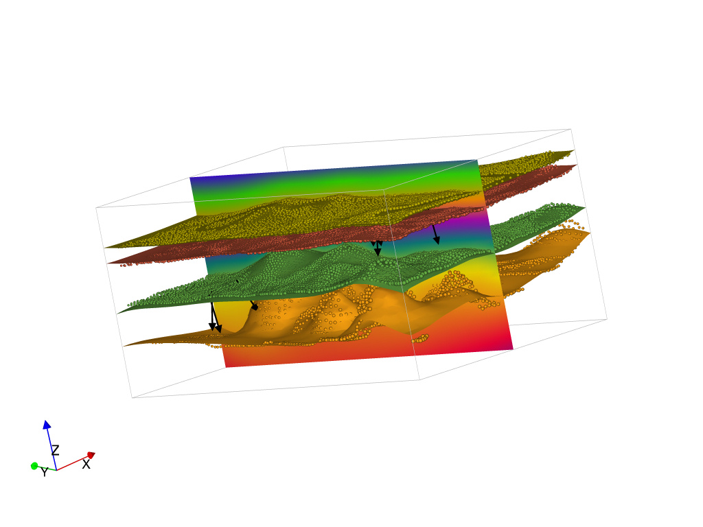
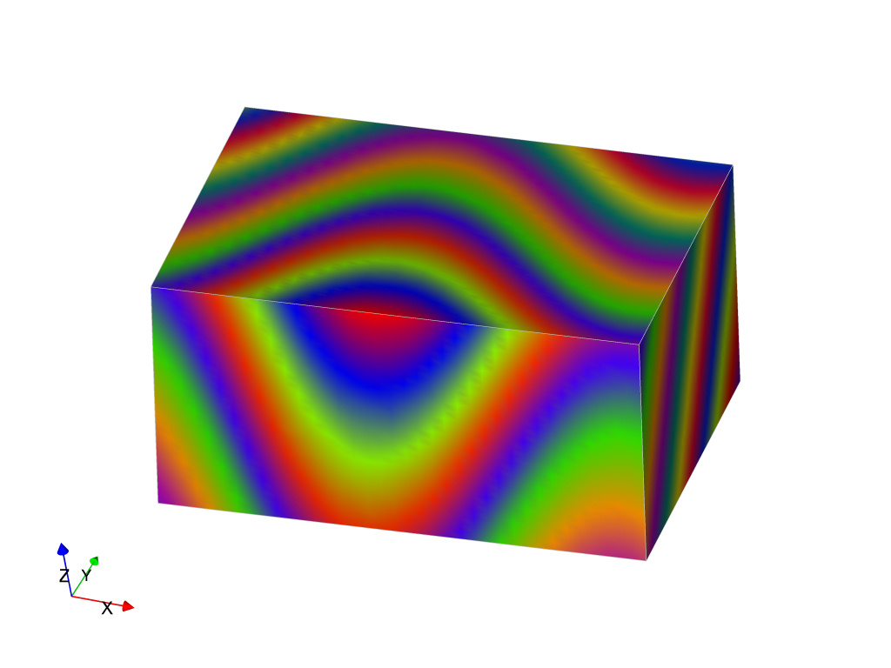
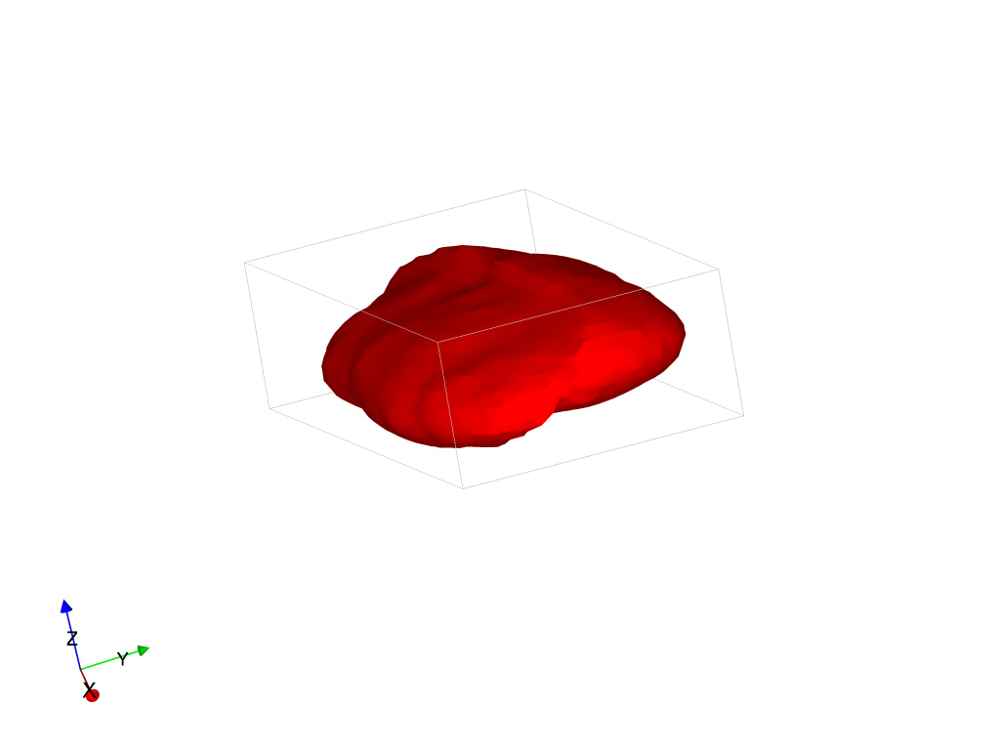
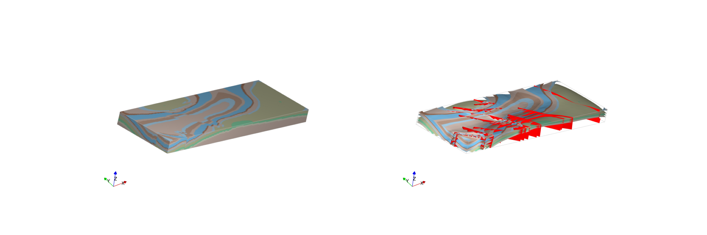

# LoopStructuralWorkshop

## Installing LoopStructural
LoopStructural can be installed using the python package manager pip
`pip install LoopStructural`
To run the notbooks you will also need to install jupyter `pip install jupyter`, ipywidgets `pip install ipywidgets` and `jupyter nbextension enable --py widgetsnbextension` and SurfE `pip install surfe`

## LoopStructural github
Please show your support for LoopStructural by starring the repository at https://github.com/Loop3D/LoopStructural

## Loop

## Workshop outline
During this workshop you will use jupyter notebooks to build implicit geological models using LoopStructural, with examples  
* The [first tutorial](notebooks/Example1.ipynb) will cover interpolating a conformable stratigraphic horizon using LoopStructural in this tutorial you will learn how to:

 * The [second example](notebooks/Example2.ipynb) introduces using structural frame (fold frame) for modelling folded surfaces and provides a comparison to using classical methods.

   
* The [third example](notebooks/Example3.ipynb) uses the fold frame to model a type 3 interference pattern using a time aware approach for modelling each foliation field from structural data.

* The [fourth example](notebooks/Example4.ipynb) a uses structural frames for modelling faults showing a simple example of a faulted intrusion.

    
* The [fifth example](notebooks/Example5.ipynb) we use map2loop, the data preprocessing tool from Loop to generte an input dataset from regional geological maps in the Hamersley region in Western Australia

